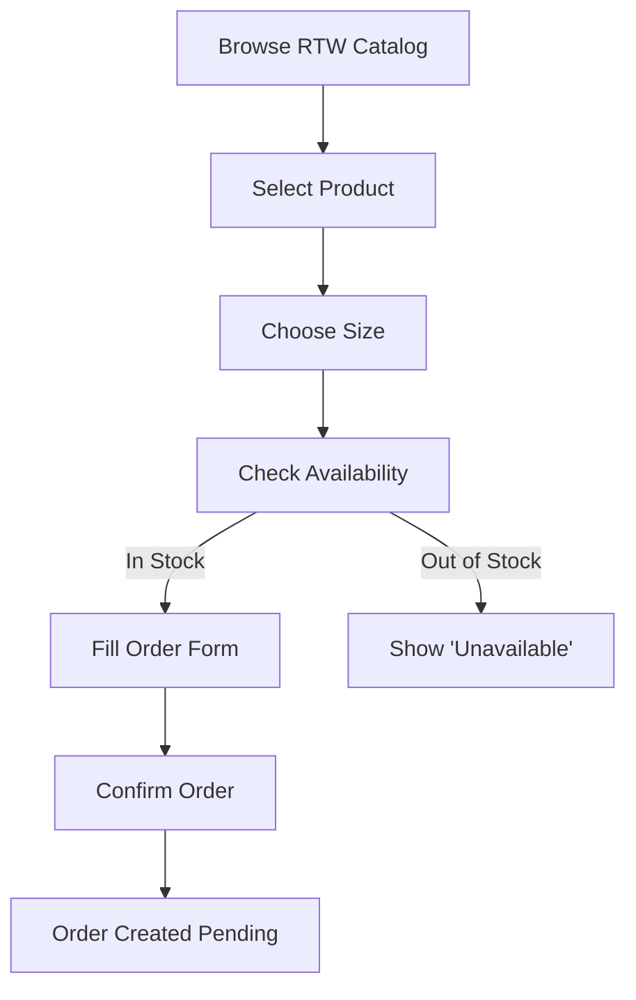
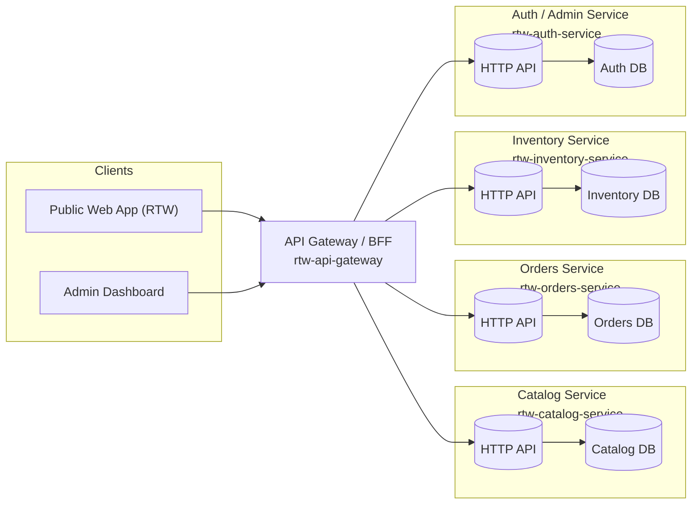
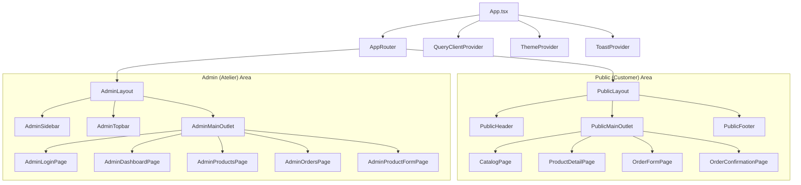

<!-- README.md -->

# 🧵 **Solange Bernard — Maison de Couture**

A modern **all-in-one SaaS** built from the ground up for couture ateliers.

It centralizes and elevates every operational, creative, and commercial workflow:

- client reception & measurement tracking  
- model selection & creative validation  
- production planning & team coordination  
- appointments & delivery schedule  
- inventory & materials management  
- revenue, expenses & insights  
- marketing & client engagement automation  

> **Mission**  
> Empower couture ateliers to deliver excellence, streamline their workflow, and grow sustainably — without ever compromising artistry.

> **Vision**  
> Become the **digital operating system for couture ateliers across Africa and beyond**, blending traditional craftsmanship with world-class technology.

📚 For deeper docs and specs, see [`/docs`](./docs) in the repo.

---

## 🔗 Quick Links

- 🧠 [1. Atelier Reality: Workflow & Roles](#1-atelier-reality-workflow--roles)
- 📊 [2. Core Problems to Solve](#2-core-problems-to-solve)
- 🧭 [3. Strategy & Phasing (RTW-First)](#3-strategy--phasing-rtw-first)
- 🧺 [4. RTW MVP Zero — What We Actually Build First](#4-rtw-mvp-zero--what-we-actually-build-first)
- 🗃️ [5. Canonical Domain Model (ERD)](#5-canonical-domain-model-erd)
- 🔄 [6. Order Lifecycle & Stock Behaviour](#6-order-lifecycle--stock-behaviour)
- 🧍 [7. Customer Flow (RTW Ordering Journey)](#7-customer-flow-rtw-ordering-journey)
- 🏗️ [8. System Architecture (Microservices + Gateway)](#8-system-architecture-microservices--gateway)
- 🖥️ [9. Frontend Architecture (React App Structure)](#9-frontend-architecture-react-app-structure)
- 🎨 [10. Design & Documentation Workflow](#10-design--documentation-workflow)
- 🧰 [11. Technology Stack](#11-technology-stack)
- 📏 [12. Engineering Principles & Success Criteria](#12-engineering-principles--success-criteria)
- 🧩 [13. Mental Model Summary](#13-mental-model-summary)

---

## 1. Atelier Reality: Workflow & Roles

### 1.1 Real-World Atelier Workflow

1. **Client Reception & Measurement**
   - Understand client’s expectations and vision  
   - Take detailed measurements  
   - Record notes, fabrics, inspirations

2. **Model Selection & Design Validation**
   - Client chooses model  
   - Designer provides sketch or proposal  
   - Approvals + revisions captured digitally  
   - Delivery appointment is planned

3. **Production Planning & Tracking**
   - Internal calendar planning  
   - Task assignments by role  
   - Deadlines per stage (cutting → sewing → QC)  
   - Real-time progress status

4. **Appointments & Delivery**
   - Fittings  
   - Mid-stage adjustments  
   - Final delivery

5. **Production Pipeline**
   - Cutting  
   - Sewing  
   - QC preparation

6. **Quality Control**
   - Verify conformity to model  
   - Measurement accuracy  
   - Finishing / stitching check  
   - Photo reference & issue flags

### 1.2 Roles Inside Solange Bernard’s Atelier

- **Receptionist / Manager**
  - Welcome clients, take measurements  
  - Manage appointments & client files  
  - Communicate with production team  
  - Handle follow-ups

- **Cutter**
  - Interpret patterns & sketches  
  - Cut fabric accurately  
  - Collaborate with designers & seamstresses

- **Seamstress / Tailor**
  - Sew according to specs  
  - Perform fittings & adjustments  
  - Ensure finishing quality

- **Quality Control Specialist (to introduce)**
  - Inspect finished garments  
  - Validate against design & measurements  
  - Document issues  
  - Tag garments: **Ready / Needs Fix / Reject**

These real roles shape the **domain model, flows, and UI** of the platform.

---

## 2. Core Problems to Solve

### 2.1 Business & Operations

1. **Sur-mesure is draining and not profitable enough**
   - Huge time investment per client  
   - Physically exhausting  
   - Margins too low

2. **No visibility or marketing**
   - No real online presence or strategy  
   - Word-of-mouth only

3. **Information chaos**
   - Paper measurement sheets  
   - No centralized system  
   - Progress not tracked  
   - Missed appointments  
   - Scattered info everywhere

4. **Quality control issues**
   - Measurement errors  
   - Model deviations  
   - Stitching problems

5. **Productivity & motivation**
   - No performance tracking  
   - No incentives  
   - No KPIs

### 2.2 Strategic Product Objectives

1. **Unify all atelier operations** into one central platform  
2. **Eliminate mistakes** (measurements, deadlines, design misalignment)  
3. **Increase productivity** through structured workflows  
4. **Standardize excellence** across all ateliers using the platform  
5. **Create a premium digital client experience**  
6. **Arm the atelier with data** (production, finances, workload, sales)

---

## 3. Strategy & Phasing (RTW-First)

### 3.1 High-Level Phases

1. **Phase 0 — RTW MVP (Highest Priority)**
   - Catalog, stock, orders, delivery  
   - Minimal but functional e-commerce front

2. **Phase 1 — Atelier Operations MVP**
   - Measurements, model validation  
   - Production workflow & QC

3. **Phase 2 — Client Experience Layer**
   - Notifications, customer portal, order tracking

4. **Phase 3 — Inventory & Fabric Management**
   - Fabrics, materials, tools, suppliers, low-stock alerts

5. **Phase 4 — Advanced SaaS**
   - Multi-tenant, analytics, AI, marketplace  
   - → **Powered by V∅ID Labs**

### 3.2 Top Priorities (Business View)

1. **PRIORITY #1 — Ready-to-Wear**
   - Collection plan  
   - Stock system  
   - E-commerce  
   - Size chart management  
   - Photo catalog  
   - Visibility strategy

2. **PRIORITY #2 — Marketing & Visibility**
   - Revamp Facebook page  
   - Early teasers for RTW line

3. **PRIORITY #3 — Information Flow**
   - Digitize: measurements, approvals, calendar, appointments, clients, inventory

4. **PRIORITY #4 — Quality Control**
   - Checklist system (measurements, model conformity, stitching quality)

5. **PRIORITY #5 — Productivity**
   - Soft KPIs, training, bonuses

---

## 4. RTW MVP Zero — What We Actually Build First

**Goal:** Launch a minimal RTW product line with digital catalog + stock + order flow.

### 4.1 Must-Have Modules (Phase 0)

1. **Product Catalog**
   - Add RTW products  
   - Fields: name, photos, description, sizes, price, stock per size  
   - Core of the RTW experience

2. **Stock Management**
   - Track stock per size  
   - Reduce stock when order placed  
   - Block orders when stock = 0  
   - Manual stock adjustments

3. **Order Placement (Customer-Facing)**
   - Customer submits order  
   - Required fields: name, phone, address, product + size, payment method (mobile money / cash-on-delivery)  
   - Order summary page

4. **Order Management (Internal)**
   - List all orders  
   - Update status: `Pending → Confirmed → OutForDelivery → Delivered / Cancelled`  
   - Track payment status

5. **Delivery Tracking (Simple)**
   - Optional assignment of delivery person  
   - Mark “Out for Delivery” / “Delivered”

6. **Basic Authentication (Internal Only)**
   - Admin login to add products & manage orders

7. **Simple Reporting**
   - Units sold per product  
   - Low stock alerts  
   - Basic revenue overview

### 4.2 RTW Entities (Phase 0)

Only **five** core entities:

1. `Product`  
2. `ProductVariant` / `StockItem` (per-size stock)  
3. `Order`  
4. `OrderItem`  
5. `AdminUser`  

---

## 5. Canonical Domain Model (ERD)

> **This is the single source of truth for all RTW MVP Zero data.**

```mermaid
erDiagram
    %% =========================
    %% CATALOG CONTEXT
    %% =========================
    Product ||--o{ ProductVariant : has
    Product ||--o{ ProductImage  : has

    Product {
        string  id
        string  name
        string  slug
        string  description
        float   price
        boolean isPublished
        datetime createdAt
        datetime updatedAt
    }

    ProductVariant {
        string id
        string productId
        string size
        string color
        string sku
    }

    ProductImage {
        string id
        string productId
        string url
        string altText
        int    position
    }

    %% =========================
    %% INVENTORY CONTEXT
    %% =========================
    ProductVariant ||--|| StockItem : tracked_by

    StockItem {
        string  id
        string  productVariantId
        int     quantity
        int     safetyStock
        datetime updatedAt
    }

    %% =========================
    %% ORDERS / SALES CONTEXT
    %% =========================
    Order ||--o{ OrderItem    : contains
    Order ||--o| DeliveryInfo : has

    Order {
        string  id
        string  status           "Pending | Confirmed | OutForDelivery | Delivered | Cancelled"
        string  customerName
        string  customerPhone
        string  customerAddress
        string  paymentMethod    "e.g. cash_on_delivery"
        string  paymentStatus    "e.g. pending | paid"
        datetime createdAt
        datetime updatedAt
    }

    OrderItem {
        string id
        string orderId
        string productId
        string productVariantId
        float  unitPrice
        int    quantity
    }

    DeliveryInfo {
        string  id
        string  orderId
        string  deliveryStatus   "mirrors/shadows order status or adds sub-status"
        datetime plannedDate
        datetime actualDate
        string  notes
    }

    %% =========================
    %% AUTH / ADMIN CONTEXT
    %% =========================
    AdminUser ||--o{ Product : created
    AdminUser ||--o{ Order   : managed

    AdminUser {
        string  id
        string  name
        string  email
        string  passwordHash
        string  role            "e.g. admin"
        datetime createdAt
        datetime updatedAt
    }
````

**How to read it:**

* **Catalog**: `Product` → `ProductVariant` → `ProductImage`
* **Inventory**: `StockItem` tracks quantity per `ProductVariant`
* **Orders**: `Order` → many `OrderItem` + one `DeliveryInfo`
* **Auth**: `AdminUser` creates products and manages orders

---

## 6. Order Lifecycle & Stock Behaviour

> **One state machine for the whole platform.**
> Frontend, backend, admin UI and reports all share this same definition.

```mermaid
stateDiagram-v2
    [*] --> Pending: placeOrder() [stockAvailable]

    %% Core lifecycle
    Pending --> Confirmed: confirmOrder()
    Confirmed --> OutForDelivery: startDelivery()
    OutForDelivery --> Delivered: markDelivered()

    %% Cancellation paths
    Pending --> Cancelled: cancelOrder()
    Confirmed --> Cancelled: cancelOrder()
    OutForDelivery --> Cancelled: cancelDelivery()

    %% Terminal states
    Delivered --> [*]
    Cancelled --> [*]

    %% Notes on stock behaviour (policy)
    note right of Pending
        - Stock RESERVED by decrementing available quantity
        - If cancelled here: RESTORE stock
    end note

    note right of Confirmed
        - Stock already reserved (no extra change)
        - If cancelled here: RESTORE stock
    end note

    note right of OutForDelivery
        - Items physically left the atelier
        - If cancelled here: DO NOT restore stock
    end note

    note right of Delivered
        - Final state, sale completed
        - No stock changes
    end note

    note right of Cancelled
        - Final state
        - Restoration depends on previous state:
          * From Pending / Confirmed: RESTOCK
          * From OutForDelivery: NO RESTOCK
    end note
```

This gives you **deterministic transitions** and clean APIs like:

* `POST /orders/:id/confirm`
* `POST /orders/:id/start-delivery`
* `POST /orders/:id/cancel`

---

## 7. Customer Flow (RTW Ordering Journey)

> **How a client interacts with the system from the public site.**



* Minimal friction, single product + single size per order (MVP).
* Directly creates an `Order` in `Pending` state → feeds into the **order lifecycle**.

---

## 8. System Architecture (Microservices + Gateway)

> **How everything is wired together behind the scenes.**



**Key ideas:**

* Each microservice owns its own database (**no shared DB**).
* API Gateway / BFF:

  * handles routing, auth, and response shaping
  * is the single entry point for web & admin clients
* Later, domain events can supplement HTTP for more advanced flows.

---

## 9. Frontend Architecture (React App Structure)

> **How the UI is structured into public and admin areas.**



* **Public Area** → Customer catalog + order flow
* **Admin Area** → Product, stock, and order management
* Shared infrastructure: **React Query**, theme, toasts, etc.

---

## 10. Design & Documentation Workflow

> **Everything design-related is structured and linked to Jira.**

| Folder          | Jira Phase                       | Purpose                                 |
| --------------- | -------------------------------- | --------------------------------------- |
| `inspirations/` | Creative Discovery & Inspiration | Moodboards, references, benchmarks      |
| `ux-flows/`     | Creative Discovery & Inspiration | User journeys, personas, diagrams       |
| `wireframes/`   | Wireframing & UX Blueprint       | Low-fi layouts & IA                     |
| `mockups/`      | Mockups & Visual Design          | Figma exports, high-fi screens          |
| `style-guide/`  | Visual System                    | Tokens, palette, typography, components |

Each artefact is **versioned** and **linked to Jira** for traceability.

---

## 11. Technology Stack

### Design & Productivity

* Mermaid (diagrams)
* DrawSQL (DB schema)
* Figma (UX/UI)
* VS Code
* Git + GitHub
* Agile + Scrum
* Jira

### Core Backend Stack

* TypeScript-first ecosystem
* Node.js, Express
* PostgreSQL + MongoDB
* Prisma ORM

### Frontend

* React + Vite
* PrimeReact
* TailwindCSS
* i18next

### State & Data

* Zustand
* React Query
* GraphQL (Apollo)
* Redis

### Mobile

* Expo
* React Native

### DevOps

* pnpm (Monorepo)
* Docker
* GitHub Actions
* Husky + lint-staged
* Commitlint
* validate-branch-name

### Testing

* Vitest
* React Testing Library
* Supertest
* Postman
* Playwright

### Infra & Delivery

* AWS (EC2, S3, RDS)
* Cloudflare
* Vercel
* Render
* AlwaysData

### Other

* Stripe
* Socket.io
* Swagger
* Sentry
* Electron

---

## 12. Engineering Principles & Success Criteria

### Ways of Working

* Style guide & design system discipline
* UX/UI inspirations (Awwwards, Dribbble…)
* Scrum with Jira
* Clean Architecture
* Domain-Driven Design
* Microservices (API Gateway, service discovery, DB per service)
* TDD as default
* CI/CD pipelines
* UML & Mermaid for modelling
* JSDoc for documentation
* A11y & i18n baked in
* Security & privacy from day 1
* Performance optimization
* Monitoring & logging
* SEO + PWA + offline sync
* Responsive + mobile-first
* Scalability planning

### Concrete Success Metrics (Examples)

* **Operations**

  * 90% of production tasks tracked in real-time
  * 100% of measurements stored digitally
  * Missed deadlines & rework ↓ 40%
  * Fabric waste ↓ 25%

* **Business**

  * Atelier output ↑ 30% with same staff
  * Real sales happening within 2–4 weeks after RTW MVP deployment

* **UX**

  * NPS ≥ 9/10
  * Onboarding new staff in < 1 day
  * No paper backups after 3 months

* **Technical**

  * 99.9% uptime
  * Multi-tenant support for 100+ ateliers & 1000+ clients each
  * 80%+ code coverage
  * Fully automated CI/CD
  * Developer onboarding < 1 week

---

## 13. Mental Model Summary

This single README gives the **big picture**:

* **Domain & reality** → Atelier workflow, roles, problems
* **Strategy** → RTW-first, phased roadmap
* **Data** → Canonical ERD
* **Behaviour** → Order lifecycle & stock rules
* **Experience** → Customer flow & admin workflows
* **Architecture** → Microservices + gateway + frontend structure
* **Execution** → Tech stack, design directory, engineering practices, success metrics

Anyone joining the project (business or technical) should be able to read this file and **understand how the RTW platform and the broader atelier system fit together** from A to Z.
