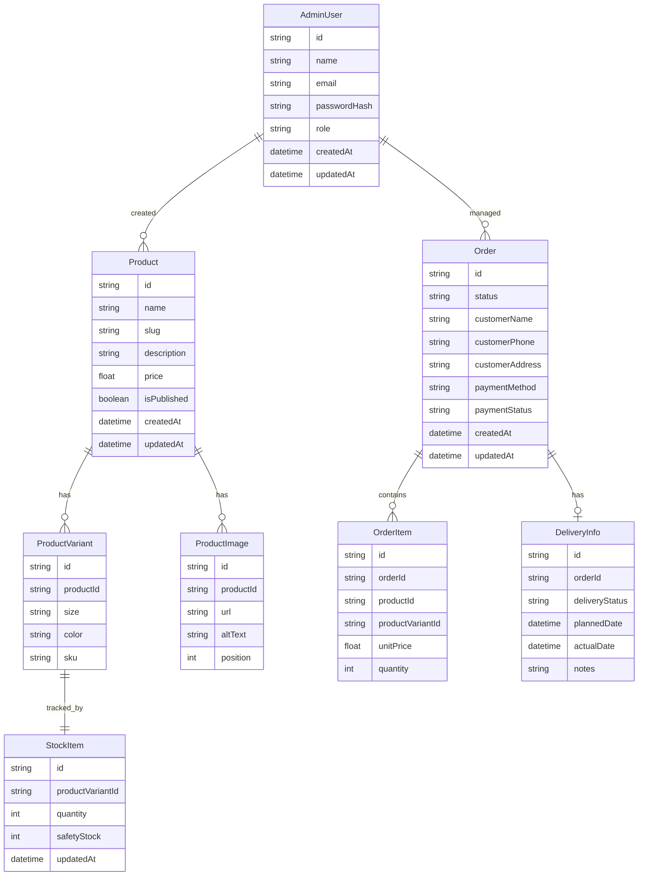
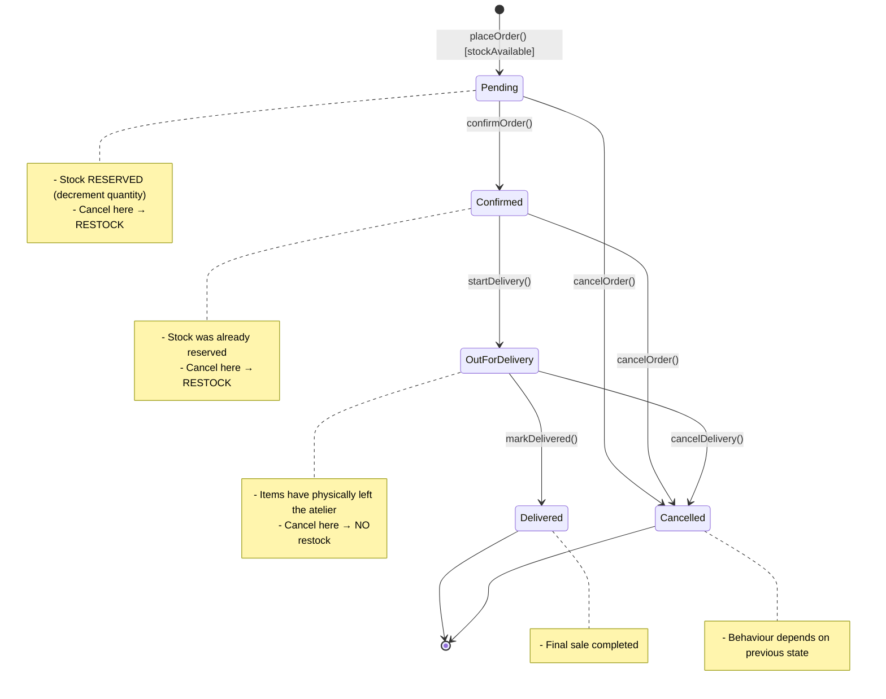
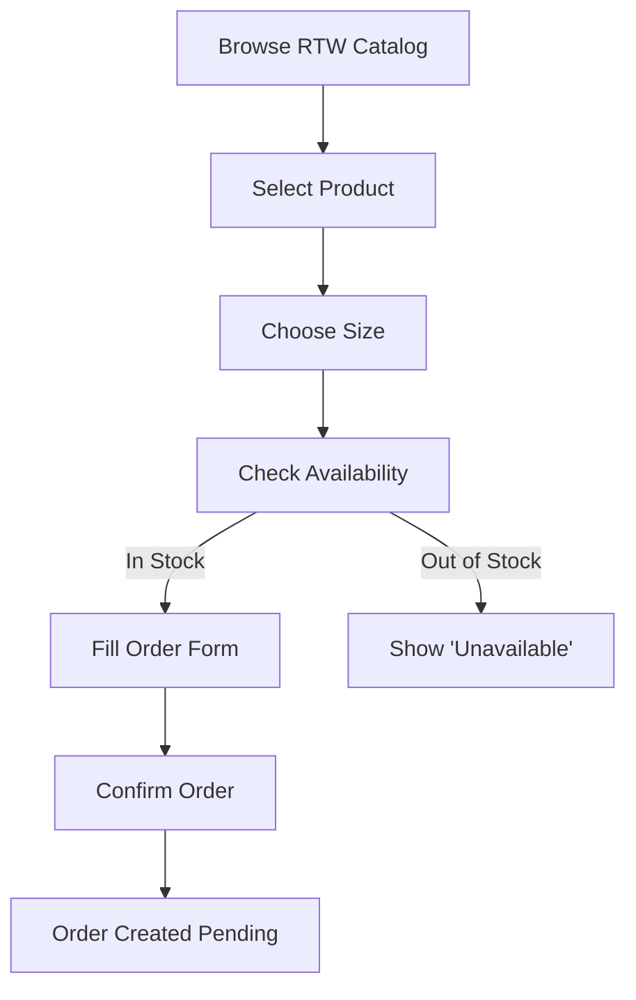
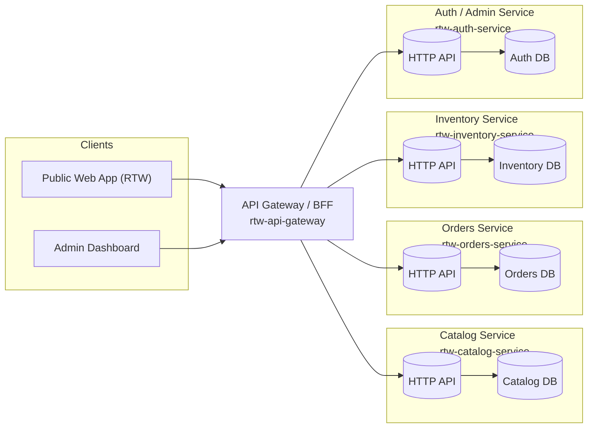
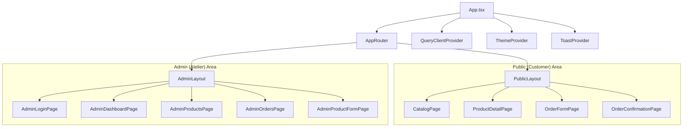

# 🧵 **RTW MVP Zero — Architecture Overview**

This document summarizes the entire Ready-to-Wear (RTW) MVP Zero system using **five essential diagrams**:

1. **Canonical ERD** (what data exists and how it connects)
2. **Order Lifecycle** (how orders move through the system + stock rules)
3. **Customer Flow** (how customers place orders)
4. **System Architecture** (microservices + databases + frontend)
5. **Frontend Structure** (how the app is organized)

Together, these diagrams provide the complete conceptual foundation of the RTW platform.

---

# 1. 📦 Canonical Domain Model (ERD)

This is the **single source of truth** for all data in RTW MVP Zero.

---

# 2. 🔄 Order Lifecycle & Stock Behaviour

This state machine defines how orders evolve and ensures **consistent stock management** across all services.

### What it enforces

* **A single universal definition of order states** across frontend, backend, and admin.
* **Correct inventory behaviour**, so stock and sales are always in sync.
* **Deterministic transitions**, allowing clean APIs such as:

  * `POST /orders/:id/confirm`
  * `POST /orders/:id/start-delivery`
  * `POST /orders/:id/cancel`

---

# 3. 🧍‍♂️ Customer Flow (MVP Ordering Process)

This is the public-facing journey.

### What it represents

* Minimal friction for the customer
* Single-product, single-size ordering (simple MVP)
* Clear alignment with the state machine (`Pending` created at step G)

---

# 4. 🏗️ System Architecture (Microservices + Gateway)

This diagram shows **how the whole RTW platform is wired together**.

### Key ideas

* **Each microservice owns its own database** (no shared DB).
* The API Gateway provides:

  * request routing
  * authentication
  * response shaping
* Services communicate only through:

  * HTTP APIs
  * or domain events later (future version)

---

# 5. 🎨 Frontend Architecture (React App Structure)

### What this expresses

* The RTW web app is split into **Public** and **Admin** zones.
* They share:

  * React Query for data
  * Theme provider
  * Toasts / notifications
* Admin routes map directly to order lifecycle transitions.

---

# 6. 🧠 Putting It All Together (Narrative Explanation)

## 6.1 Customer Perspective

1. **Browse Catalog**
   The frontend fetches `/products` from the Catalog service → via API Gateway.

2. **Select Product & Size**
   The UI loads product details + variants + available stock.

3. **Place Order**
   Customer fills the form → public API call to Orders service.

4. **Order Creation**

   * Orders service validates data
   * Inventory service **reserves** stock
   * New order is saved as `Pending`

5. **Customer sees confirmation screen**
   Done.

---

## 6.2 Admin Perspective

1. **Admin Logs In** (Auth service)
2. **Adds/Edits Products** (Catalog service)
3. **Manages Stock** (Inventory service)
4. **Receives New Orders** (Orders service)

   * All new orders appear in `Pending`
5. Admin clicks:

   * **Confirm** → order becomes `Confirmed`
   * **Start Delivery** → `OutForDelivery`
   * **Delivered** → `Delivered`
   * **Cancel** → `Cancelled` (with stock rules)

Everything aligns with the **order lifecycle**.

---

## 6.3 Services Perspective

* **Catalog** exposes product listings.
* **Inventory** tracks stock state + reservations.
* **Orders** manages order lifecycle + items.
* **Auth** handles admin authentication.
* **API Gateway** routes and protects everything.

Each service owns its data, allowing independence and scalability.

---

# 7. ✔️ Summary

These diagrams together form the entire mental model of RTW MVP Zero:

* **ERD** → what entities exist
* **Order State Machine** → how orders evolve
* **Customer Flow** → how orders are created
* **Architecture** → how services and DBs are organized
* **React Structure** → how the UI is organized

This README gives anyone (developer or non-tech) a **clear, unified, systematic understanding** of how the RTW platform works from A to Z.
